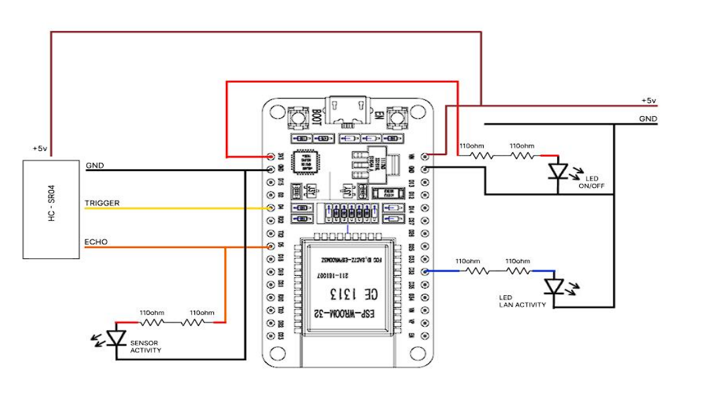
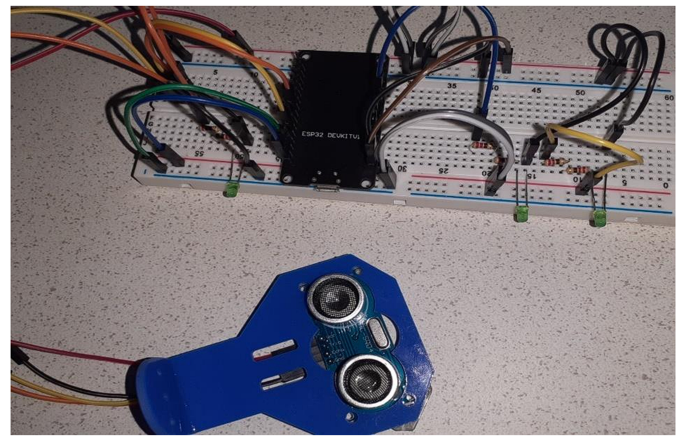
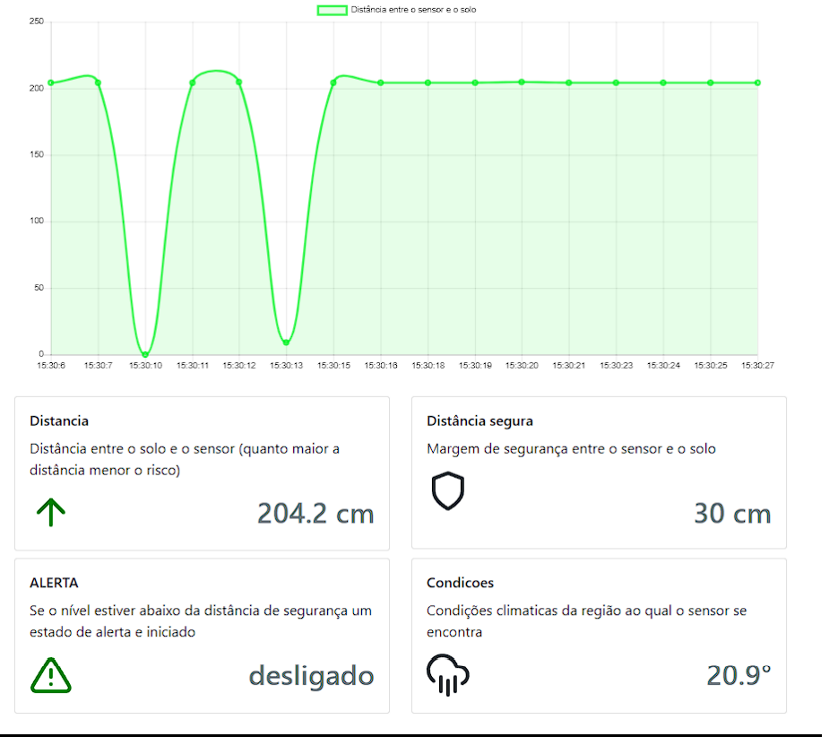
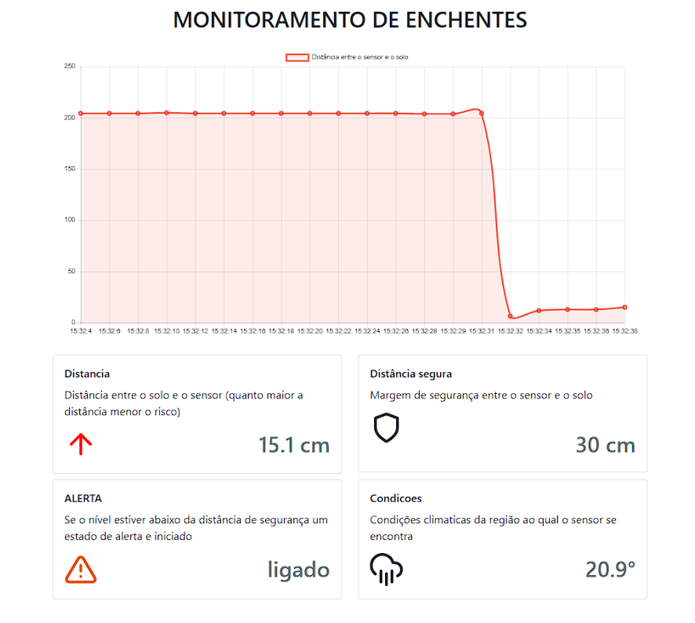

# APS 5 SEMESTRE

## Sobre

A Atividade Prática Supervisionada (APS) do 5° Semestre tem como principal 
objetivo a criação de um sistema IOT (Internet of Things) para o monitoramento de 
desastres ambientais e a visualização dos dados captados pelos sensores através de 
páginas web ou de aplicativos.

As aulas ministradas durante o semestre letivo, serviram como base para o 
desenvolvimento de um sistema embarcado utilizando um dispositivo ESP32 e um 
sensor ultrasônico para captação de dados. Escrito em C, foi criado um programa 
capaz de medir o nível de água em solos e assim evitar danos e mortes causados por 
enchentes e alagamentos

  Com o que foi aprendido durante as aulas de redes de computadores foi 
possível interligar e integrar esse sistema com um servidor local e até mesmo com a 
internet, o dispositivo em questão pode ser acessado remotamente se configurado 
para tal finalidade

**Todo o processo pode ser encontrado no pdf contido no repositório**

## Requisitos
Parte Física:
  - ESP32
  - Protoboard
  - Conectores macho e fêmea
  - leds
  - Sensor HC-SR04
Parte Lógica:
  - IDE Arduino (Criação do firmware) 
  - Python

## Esquema elétrico
 

 

 

## Como usar
No navegador acesse o endereco <a href="http://192.168.0.5:3333/api/v1/reportaenchente/stats">http://192.168.0.5:3333/api/v1/reportaenchente/</a>.

**Obs: o endereço acima é ficticio, confira o endereço atribuido ao seu dispositivo de captura.**

Será possivel então capturar os dados gerados pelo sensor
 

 
